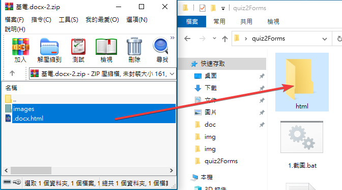

# quiz2Forms 自動題庫轉圖片

本專案基於 **文華國小陳東甫老師** 開發的 google 表單產生器 衍伸作品
可先去觀看陳東甫老師製作的 [如何全部用擷圖方式，製作數學表單的選擇題](https://resourceliteracy.weebly.com/csv35722google3492021934299862998322120214872115220837222942925524433292552115133021.html) 教學，再回來使用本專案

# 使用教學

## 1. 複製題庫答案至 Anser.txt

目前只能自動處理 ABCD 格式的答案，不是的可以建表後手動輸入。

## 2. 清理 Word

將題庫清理乾淨，只留下題目，答案、詳解全部刪除

## 3. 下載主程式 : [載點](https://github.com/Crazycurly/quiz2Forms/releases)

## 4. 解壓縮

解壓縮後會有這些檔案

## 5. 上傳題庫至 Google Driver

將要轉換的題庫上傳至雲端

## 6. 轉換為 html

用 Google 文件開啟後點選 檔案 > 下載 > 網頁(html)

## 7. 解壓縮

將下載下來的網頁解縮至 **html** 資料夾內，如果裡面有檔案先刪除

## 8. 運行截圖

執行 **1.截圖.bat** 看到 Finish 截圖完成，按任意鍵退出。

## 9. 檢查截圖

檢查 **img** 資料夾裡的截圖看是否完整

## 10. 運行建表

執行 **2.建表 + 答案.bat** ，無答案執行 **2.建表.bat**，看到 Finish 完成，按任意鍵退出。

## 12. 上傳輸出
將輸出的 **OUTPUT.docx** 上傳至 Google Driver ，後使用 Google 文件開啟

(因為直接從 word 複製無法複製圖片)

## 13. 複製至表單產生器

將 output.docx 的內容全選複製至 **表單產生器** 的 **表格二**

## 11.後續步驟參考 [文華國小表單產生器 全部用擷圖方式的教學即可](https://resourceliteracy.weebly.com/csv35722google3492021934299862998322120214872115220837222942925524433292552115133021.html)

